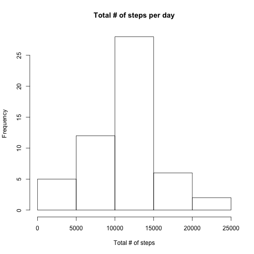
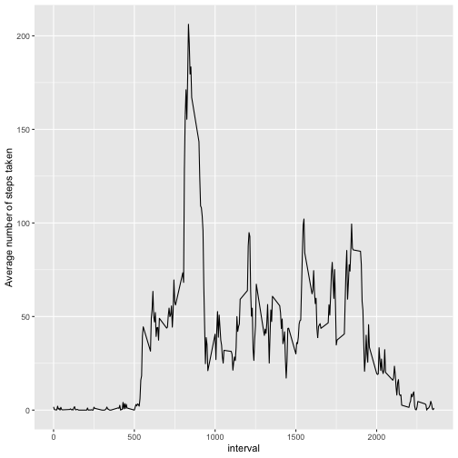
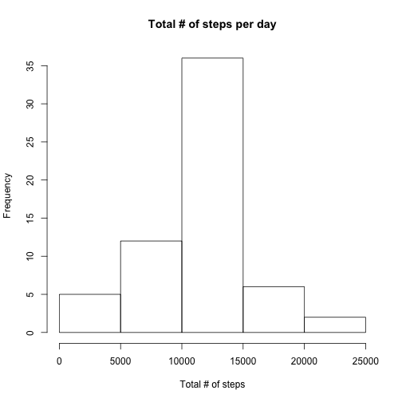
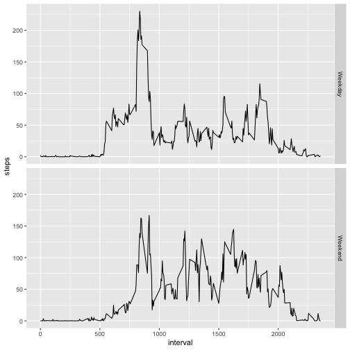

# Reproducible Research:  Assessment 1

## Loading and preprocessing the data

```r
library(dplyr)
library(ggplot2)
Data <- read.csv("activity.csv")
str(Data)
```

```
## 'data.frame':	17568 obs. of  3 variables:
##  $ steps   : int  NA NA NA NA NA NA NA NA NA NA ...
##  $ date    : Factor w/ 61 levels "2012-10-01","2012-10-02",..: 1 1 1 1 1 1 1 1 1 1 ...
##  $ interval: int  0 5 10 15 20 25 30 35 40 45 ...
```

```r
summary(Data)
```

```
##      steps                date          interval     
##  Min.   :  0.00   2012-10-01:  288   Min.   :   0.0  
##  1st Qu.:  0.00   2012-10-02:  288   1st Qu.: 588.8  
##  Median :  0.00   2012-10-03:  288   Median :1177.5  
##  Mean   : 37.38   2012-10-04:  288   Mean   :1177.5  
##  3rd Qu.: 12.00   2012-10-05:  288   3rd Qu.:1766.2  
##  Max.   :806.00   2012-10-06:  288   Max.   :2355.0  
##  NA's   :2304     (Other)   :15840
```

```r
Data_Comp <- na.omit(Data)
```

## What is mean total number of steps taken per day?
### 1. Calculate the total number of steps taken per day.

```r
Databydate <- Data_Comp %>% select(date, steps) %>% group_by(date) %>% summarize(totalsteps = sum(steps))
head(Databydate)
```

```
## # A tibble: 6 x 2
##   date       totalsteps
##   <fct>           <int>
## 1 2012-10-02        126
## 2 2012-10-03      11352
## 3 2012-10-04      12116
## 4 2012-10-05      13294
## 5 2012-10-06      15420
## 6 2012-10-07      11015
```

### 2. Make a histogram of the total number of steps taken each day

```r
hist(Databydate$totalsteps, xlab = "Total # of steps", main = "Total # of steps per day")
```




### 3. Calculate and report the mean and median of the total number of steps taken per day

```r
mean(Databydate$totalsteps)
```

```
## [1] 10766.19
```

```r
median(Databydate$totalsteps)
```

```
## [1] 10765
```

## What is the average daily activity pattern?
### 1. Make a time series plot

```r
Data_Int <- group_by(Data_Comp, interval)
Data_Int <- summarize(Data_Int, steps = mean(steps))
ggplot(Data_Int, aes(x = interval, y = steps)) + geom_line() + ylab("Average number of steps taken")
```




### 2. Which 5-minute interval, on average across all the days in the dataset, contains the maximum number of steps?

```r
Data_Int[Data_Int$steps == max(Data_Int$steps),]
```

```
## # A tibble: 1 x 2
##   interval steps
##      <int> <dbl>
## 1      835  206.
```


## Imputing missing values 
### 1. Calculate and report the total number of missing values in the dataset (i.e. the total number of rows with NA NAs)

```r
sum(is.na(Data))
```

```
## [1] 2304
```

### 2. Devise a strategy for filling in all of the missing values in the dataset. The strategy does not need to be sophisticated.

```r
names(Data_Int)[2] <- "meansteps"
Data_Imp <- merge(Data, Data_Int)
```

### 3. Create a new dataset that is equal to the original dataset but with the missing data filled in.

```r
Data_Imp$steps[is.na(Data_Imp$steps)] <- Data_Imp$meansteps[is.na(Data_Imp$steps)]
```

### 4. Make a histogram, Mean and Median?

```r
Data_Imp_Date <- group_by(Data_Imp, date)
Data_Imp_Date <- summarize(Data_Imp_Date, steps=sum(steps))
hist(Data_Imp_Date$steps, xlab = "Total # of steps", main = "Total # of steps per day")
```



```r
mean(Data_Imp_Date$steps)
```

```
## [1] 10766.19
```

```r
median(Data_Imp_Date$steps)
```

```
## [1] 10766.19
```

### The mean appears to be unaffected by this imputation. The median is to be increased by imputation.


## Are there differences in activity patterns between weekdays and weekends?

### 1. Create a new factor variable in the dataset with two levels – “weekday” and “weekend” indicating whether a given date is a weekday or weekend day.

```r
Data_Imp$dayofweek <- weekdays(as.Date(Data_Imp$date))
Data_Imp$weekend <-as.factor(Data_Imp$dayofweek=="Saturday"|Data_Imp$dayofweek=="Sunday")
levels(Data_Imp$weekend) <- c("Weekday", "Weekend")
```


### 2. Make a panel plot containing a time series plot

```r
Data_weekday <- Data_Imp[Data_Imp$weekend=="Weekday",]
Data_weekend <- Data_Imp[Data_Imp$weekend=="Weekend",]

Data_Int_Weekday <- group_by(Data_weekday, interval)
Data_Int_Weekday <- summarize(Data_Int_Weekday, steps=mean(steps))
Data_Int_Weekday$weekend <- "Weekday"
Data_Int_Weekend <- group_by(Data_weekend, interval)
Data_Int_Weekend <- summarize(Data_Int_Weekend, steps=mean(steps))
Data_Int_Weekend$weekend <- "Weekend"

Data_Int_Week <- rbind(Data_Int_Weekday, Data_Int_Weekend)
Data_Int_Week$weekend <- as.factor(Data_Int_Week$weekend)
ggplot(Data_Int_Week, aes(interval, steps)) + geom_line() + facet_grid(weekend ~ .)
```


